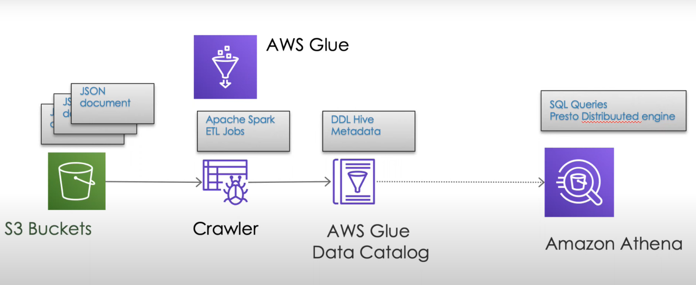
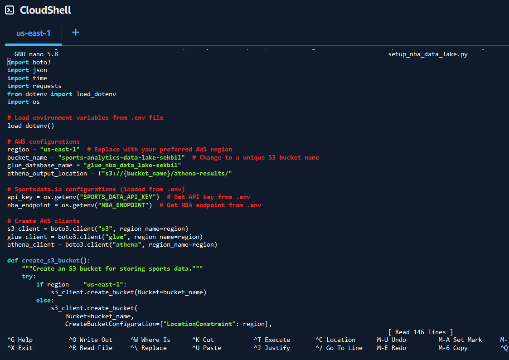
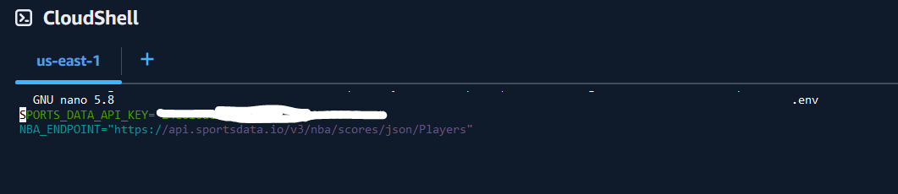
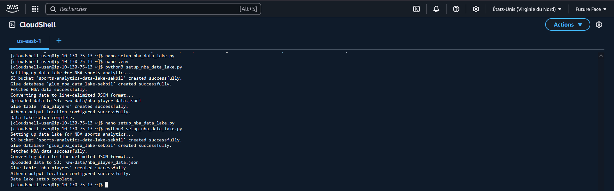
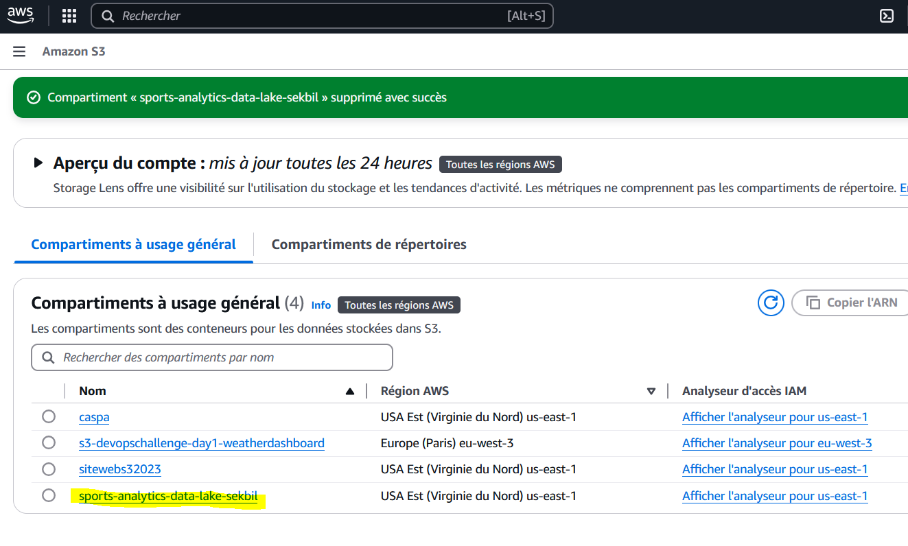
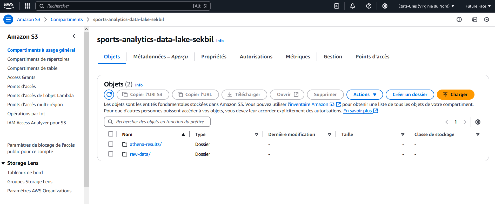
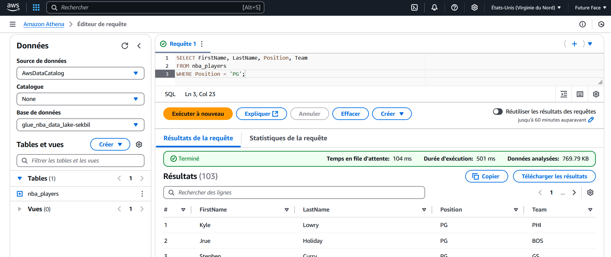

# Script Python DataLake NBA
Ce script  (setup_nba_data_lake.py) automatise la création et la mise en production de services AWS. Il met en oeuvre les bases pour l'architecture d'un DataLake  dédiés à l'analyses de données NBA à l'aide d'AWS S3, AWS Glue et AWS Athena.

# Fonctionnalités
 Actions réalisées par le scripts : 
- Crée un compartiment Amazon S3 pour stocker les données brutes et traitées.
- Télécharge des exemples de données NBA (format JSON) dans le compartiment S3.
- Crée une base de données AWS Glue et une table externe pour interroger les données.
- Configure Amazon Athena pour interroger les données stockées dans le compartiment S3.


# Préréquis

- "SportsDataIO API Free Trial"  /  "Launch Developer Portal" / NBA /"Standings" / "Query String Parameters"/  API key
- Copier la clée API

- IAM Role/Permissions:  
    - - S3: s3:CreateBucket, s3:PutObject, s3:DeleteBucket, s3:ListBucket
    - - Glue: glue:CreateDatabase, glue:CreateTable, glue:DeleteDatabase, glue:DeleteTable
    - - Athena: athena:StartQueryExecution, athena:GetQueryResults

#  
# Etape 1:   CloudShell Console

1. Aller sur aws.amazon.com et conectez vous à votre compte puis sur CloudShell 

2. Allez dans las zonne de l'invite de commande a >_  

# Etape 2 : Création et configuration du script setup_nba_data_lake.py avec nano
1.  Dans l'invite de commande CloudShell
```bash
nano setup_nba_data_lake.py
```
2. Dans une autre fenêtre récupérez le script sur [GitHub](https://github.com/sekedoua/NBA-Datalake/blob/main/src/setup_nba_data_lake.py)

- Copier et coller le contnu du script  setup_nba_data_lake.py  dans l'invite de commande nano
- Sauvegarder le fichier : Ctrl+X pour sortir puis Y pour confirmer l'enregistrement



# Etape 3 Create le fichier des variables d'environnement .env  
1.  
```bash
nano .env
```
2. Collez la ligne de code suivante dans votre fichier, assurez-vous d'utiliser votre clé API
```bash
SPORTS_DATA_API_KEY="votre_sportsdata_api_key"
NBA_ENDPOINT="https://api.sportsdata.io/v3/nba/scores/json/Players"
```
- Sauvegarder le fichier : Ctrl+X pour sortir puis Y pour confirmer l'enregistrement



# Etape 4: Exécuter le script
1. Dans l'invite de commande taper
```bash
python3 setup_nba_data_lake.py
```
- Vous devriez voir que les ressources ont été créées avec succès,  des données exemple ont été chargée avec succès et la configuration du DataLake réalisée.



# Etape 5 :  Vérification manuelle que les ressources ont bien été créées
1. Dans la barre de recherche, tapez S3 et cliquez sur le nom du lien hypertexte bleu

    -  Vous devriez voir 2 compartiments à usage général nommés « noms_que_vous_avez_données_dans_le_script_python »




    -  Lorsque vous cliquez sur le nom du compartiment, vous verrez que 3 objets se trouvent dans le compartiment

2. Cliquez sur raw-data et vous verrez qu'il contient « nba_player_data.json »

3. Cliquez sur le nom du fichier et en haut, vous verrez l'option Ouvrir le fichier

    - Vous verrez une longue chaîne de diverses données NBA

4. Rendez-vous sur Amazon Athena et vous pouvez coller l'exemple de requête suivant :
```bash
SELECT FirstName, LastName, Position, Team
FROM nba_players
WHERE Position = 'PG';
```
- Cliquer Exécuter
- Vous devriez voir le résultat de la requete plus bas. 


# Etape 6 :  Suppression des ressources pour éviter d'être facturé
1. Dans l'invite de commande taper
```bash
python3 delete_aws_ressources.py
```

### **Ce que nous avons appris**
1. Sécurisation des services AWS avec des politiques IAM de moindre privilège.
2. Automatisation de la création de services avec un script.
3. Intégration d'API externes dans des flux de travail basés sur le cloud.

